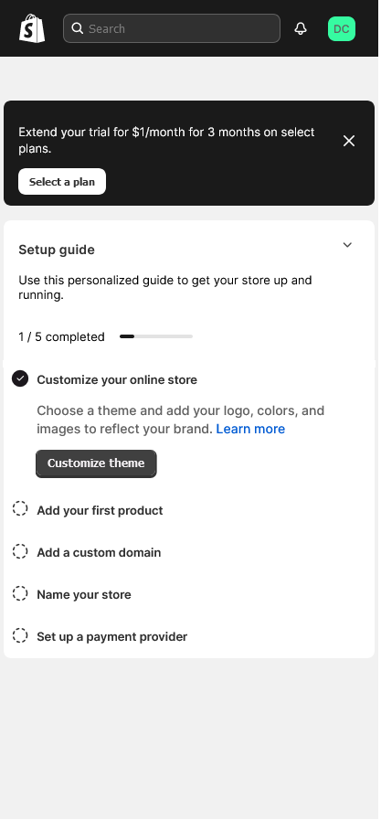

# Shopify Dashboard - Replica

Replica of the Shopify Merchant Onboarding Dashboard page.

## Table of contents

- [Overview](#overview)
  - [The challenge](#the-challenge)
  - [Screenshot](#screenshot)
  - [Links](#links)
  - [Built with](#built-with)
  - [What I learned](#what-i-learned)
  - [Useful resources](#useful-resources)
- [Author](#author)

## Overview

This project is a solution to the [Level up Front Hackathon chhallenge](https://www.crushingit.tech/hackathon).

### The challenge

Build the merchant onboarding experience as per the [Figma design](https://www.figma.com/file/W4IHXzpdgxrUMWuymS9R9i/Level-Up-Front-Hackathon?type=design&node-id=0-1&mode=design) and cater to three types of users:
- Mouse users
- Keyboard users
- Screen reader users

### Screenshot

### Links

- Live Site URL: (https://susu-spec.github.io/shopify-dashboard/)

### Built with

- Semantic HTML5 markup
- CSS custom properties
- Flexbox
- Mobile-first workflow
- Vanilla Javascript

### Useful resources

- [How the DOM tree is built] (https://dev.to/arikaturika/how-web-browsers-work-parsing-the-html-part-3-with-illustrations-45fi)

- [How browsers work] - (https://web.dev/articles/howbrowserswork)

- [Links] - (https://www.w3schools.com/tags/att_a_target.asp)

- [Accessible Menu Components] - (https://www.crushingit.tech/courses/js-accessible-menu/what-we-will-build-and-why-its-important?utm_source=newsletter&utm_medium=email&utm_campaign=how-to-build-accessible-menu-components)

## Author

- Twitter - [@actual_susu](https://www.twitter.com/actual_susu)
